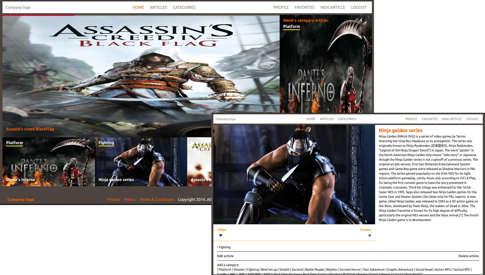

# Rails capstone

> This is a capstone project for Microverse.



## Features

- User registration and login just with a username
- User can create, edit and delete articles
- User can mark an article as favorite an see them
- User can vote an articles
- Categories displayed din order of priority and with most recent article attached to it

## Built With

- Ruby
- Ruby on Rails
- HTML 5
- SCSS
- Rspec and Capybara
- Bulma
- Rubocop

## Live Demo

[Live Demo Link](http://rails-capstone.herokuapp.com/)


## Getting Started

To get a local copy up and running follow these simple example steps.

### Prerequisites

- Ruby (version 2.7.0)
- Rails (version 5.2.4.3)
- Postgres
- Rspec

### Setup

- Go to your terminal and access the location where you want the repository (You can use "cd" comand)
- Clone the repository using git clone git@github.com:JohannRodriguez/rails-capstone.git (This will create a folder with all files in it)
- Navigate from your terminal to the new created folder
- Once inside, run the following comands:
```
$ bundle install
$ rails db:create
$ rails db:migrate
```

### Usage

- To see the page on your browser, first start the server with:
```
$ rails server
```
- Go to Chrome or Mozilla (Internet explorer not recomended!) and put http://localhost:3000/ on the addres bar

### Run tests

- Use the command:
```
$ rspec
```

- In case you get any error you can try with:
```
$ bundle exec rspec
```

## Author

👤 **Johann Rodriguez**

- Github: [@JohannRodriguez](https://github.com/JohannRodriguez)
- Twitter: [@BSapce](https://https://twitter.com/BSapce)
- Linkedin: [Johann Rodríguez](https://www.linkedin.com/in/johann-alonso-rodr%C3%ADguez-v%C3%A1zquez-25b07719a/)

## 🤝 Contributing

Contributions, issues and feature requests are welcome!

Feel free to check the [issues page](issues/).

## Show your support

Give a ⭐️ if you like this project!

## Acknowledgments

- The specifications and requirements for this project can be found [here](https://www.notion.so/Lifestyle-articles-b82a5f10122b4cec924cd5d4a6cf7561).
- This project design was based on [liFEsTlye](https://www.behance.net/gallery/14554909/liFEsTlye-Mobile-version) website concept by [Nelson Sakwa](https://www.behance.net/sakwadesignstudio).


## 📝 License

This project is [MIT](lic.url) licensed.
